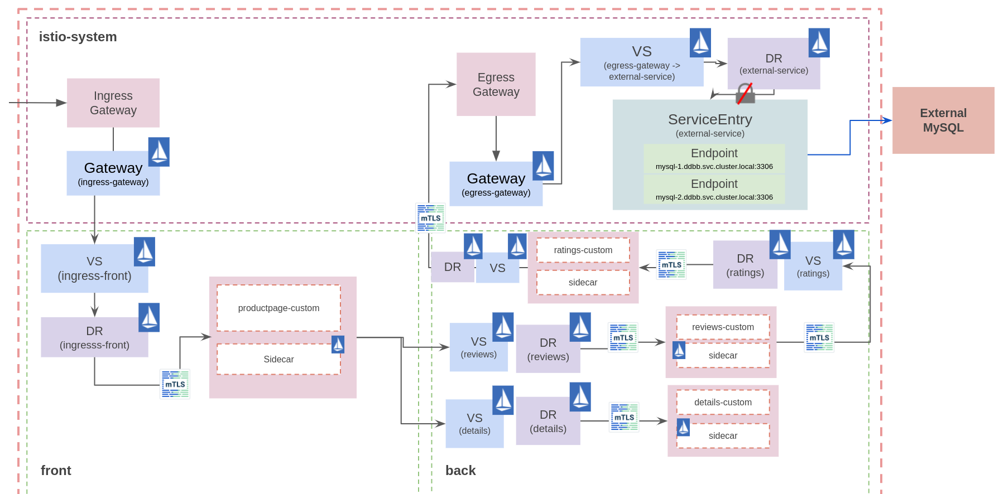

# Service Mesh Workshop

This README contains the instructions for the Service Mesh Workshop for the Iberia Customer Success Meeting. If you are participating live, please refer to the facilitators for instructions on how to use the cluster that is going to be provided. If you are doing this on your own, kindly follow the prerequisites and go to the `config` folder before starting this workshop.

## Prerequisites

- OCP cluster up and running with version 4.6 or higher.
- OpenShift Service Mesh installed
- OC cli installed.

## Download the workshop files

First of all, download the workshop files:

```bash
git clone ssh://git@gitlab.consulting.redhat.com:2222/iberia-consulting/training-and-enablement/meetups/service-mesh-workshop.git
cd service-mesh-workshop
```

## Adding services to the mesh

First, replace the User variables:

```bash
export EXTERNAL_DOMAIN=$(oc -n openshift-ingress-operator get ingresscontrollers default -o json | jq -r '.status.domain')
export USER_NAMESPACE=$(oc whoami)
export MYSQL_CLUSTER_IP=$(oc get svc mysql -n istio-system -o json | jq -r '.spec.clusterIP')
find ./labs/ -type f -print0 | xargs -0 sed -i "s/\$EXTERNAL_DOMAIN/$EXTERNAL_DOMAIN/g"
find ./labs/ -type f -print0 | xargs -0 sed -i "s/\$USER_NAMESPACE/$USER_NAMESPACE/g"
find ./labs/4-ratings-egress/ -type f -print0 | xargs -0 sed -i "s/\$MYSQL_CLUSTER_IP/$MYSQL_CLUSTER_IP/g"
find ./labs/0-certs/ -type f -print0 | xargs -0 sed -i "s/\$HOSTNAME/$HOSTNAME/g"
```
### Create TLS certificates
Create the TLS certificates to use mTLS between the client and the Istio Ingress Gateway:
```bash
labs/0-certs/certs.sh
oc create secret generic $USER_NAMESPACE-ingress-gateway-certs -n istio-system --from-file=tls.crt=./labs/0-certs/server.pem --from-file=tls.key=./labs/0-certs/server.key --from-file=ca.crt=./labs/0-certs/ca.pem
```

## Deploying the bookinfo example application

It is time to deploy the bookinfo sample application. The bookinfo sample application with external ratings database using an egress Gateway for routing TCP traffic. The bookinfo application will be deployed in two namespaces simulating front and back tiers.

Three MySQL instances are deployed outside the Mesh in the _ddbb_ project: mysql-1, mysql-2 and mysql-3. Each mysql instance has a different rating number that will be consumed by the ratings application:

- mysql-1: Ratings point equals 1.
- mysql-2: Ratings point equals 5.
- mysql-3: Ratings point equals 3.

Thus, the traffic will be balanced between the different MySQL instances.

### App diagram

The traffic flow is:

1. The sidecar intercept the request from the app container (ratings) to _mysql_.
2. The Virtual Service and Destination Rule objects route the request from the sidecar ($user-back) to the egress Gateway (istio-system).
3. At this point, the Virtual Service and Kubernetes Services objects resolve the endpoints and route the traffic through the egress Gateway.



### Deploy the Bookinfo application Namespaces (productpage=$user-front, reviews|ratings|details=$user-back)

#### Default OSSM networking

Create the Istio Gateway for exposing the application outside the cluster.

Create the Istio Ingress Gateway

```bash
oc apply -f ./labs/1-ossm-networking/gw-ingress-http-https.yaml
```

The Bookinfo application will be exposed in the public route $USER_NAMESPACE.$EXTERNAL_DOMAIN.

#### Deploying the Bookinfo application

Let's deploy the front-end of the application, the virtual service and the destination rule of the same:

```bash
oc apply -f ./labs/2-front/ -n $USER_NAMESPACE-front
```

But for the frontend to work, we need to deploy also the backend of the application:

```bash
oc apply -f ./labs/3-back/ -n $USER_NAMESPACE-back
oc process -f ./labs/3-back/bookinfo-ratings-mysql.yaml --param-file=./labs/3-back/params.env | oc apply -n $USER_NAMESPACE-back -f -
```

#### Create the Istio objects to reach the external database
Route the traffic from _ratings_ to the  egress gateway located in _istio-system_ namespace.
```bash
oc apply -n $USER_NAMESPACE-back -f ./labs/4-ratings-egress/dr-ratings-egress.yaml
oc apply -n $USER_NAMESPACE-back -f ./labs/4-ratings-egress/vs-ratings-egress.yaml
```

At this point, the application will be accesible from outside the cluster.

### Access the application

The application is exposed using HTTP and Mutual HTTPS. You can get the public OCP route by executing:
```bash
oc get routes -n istio-system | grep bookinfo-$USER_NAMESPACE
```

Two routes must exist, one for HTTP2 and one for HTTPS. To connect to the HTTP2 route, just execute:
```bash
curl -Iv http://bookinfo-$USER_NAMESPACE.$EXTERNAL_DOMAIN/productpage
```

To connect to the HTTPS route, the client certificates must be used in the curl line:
```bash
curl -vI https://bookinfo-$USER_NAMESPACE.secure.$EXTERNAL_DOMAIN/productpage --cacert labs/0-certs/ca.pem --cert labs/0-certs/client.pem --key labs/0-certs/client.key
```

## Traffic management
Let's do some taks about traffic management with OSSM.

### Lab 1: Request routing
#### Route traffic to a specific version
In this lab we will apply the rules to make all requests go to version 2 of reviews so we can see the black stars ratings.

Route the traffic to the _v2_ subset:
```bash
oc apply -n $USER_NAMESPACE-back -f labs/5-traffic-management/lab1/vs-reviews-v2.yaml
```

#### Route traffic based on headers
Now let’s think that we have a new version for the application and you want to deploy it first to a set of premium users. We are going to see how to do that in this lab where we are going to route the requests from one user in particular to version 3 of the reviews service.

Route the traffic based on the header defined in the VS:
```bash
oc apply -n $USER_NAMESPACE-back -f labs/5-traffic-management/lab1/vs-reviews-headers.yaml
```

To test this lab, click on the Sign in button at the top right of the Product Page and login as "$USER_NAMESPACE", or the user you editted in the yaml if you decided to do that. You have to write it exactly like in the yaml. And you can type whatever you want in the Password field. Then, select the _Request distribution_ field from Display menu un Kiali.

Finally, delete the VS used
```
oc delete -n $USER_NAMESPACE-back -f labs/5-traffic-management/lab1/
```

### Lab 2: Traffic Shifting and Weight Balancing
In this lab you will learn how to gradually migrate traffic from one version of a service to another.


For example, you might migrate traffic from an older version to a new version. In this example you will use reviews:v1 service as the old version and reviews:v3 service as the new version.

First, open a terminal an generate traffic:
```
watch -n 1 curl -I http://bookinfo-$USER_NAMESPACE.$EXTERNAL_DOMAIN/productpage
```

Select the _Request distribution_ field from Display menu un Kiali.

#### Route 10% of the traffic to a new service
The first modification to the _reviews_ VS to add a 90/10 routing rule.

Note that the sum of weights across destinations should be == 100. If there is only one destination in a rule, the weight value is assumed to be 100.

Apply this configuration:
```bash
oc apply -n $USER_NAMESPACE-back -f labs/5-traffic-management/lab2/vs-reviews-shifting-90-10.yaml
```

Check the result in Kiali after a while.

#### Route half the traffic to each service
The _reviews_ VS to add a 50/50 routing rule.

Apply this configuration:
```bash
oc apply -n $USER_NAMESPACE-back -f labs/5-traffic-management/lab2/vs-reviews-shifting-50-50.yaml
```

Check the result in Kiali after a while.

#### Route all the traffic to the new service
The _reviews_ VS to add a 100% routing rule to the new service.

Apply this configuration:
```bash
oc apply -n $USER_NAMESPACE-back -f labs/5-traffic-management/lab2/vs-reviews-shifting-0-100.yaml
```

Check the result in Kiali after a while.

Finally, delete the VS used
```
oc delete -n $USER_NAMESPACE-back -f labs/5-traffic-management/lab2/
```

### Lab 3: Fault Injection
OpenShift Service Mesh has mechanisms to inject faults in your application to test how it will behave when a real fault happens. This is very useful to check if your application’s recovery policies aren’t too restrictive.


In this lab you will inject two different faults in your application. A delay and an abort. Delays are timing failures and aborts are crash failures. You are going to use a similar method than in Lab 1 - Requests Routing when you routed requests using http headers, but this time you are going to inject faults for user "$USER_NAMESPACE".

#### Delay
For the delay you are going to add 7 seconds of delay between the _reviews_ and _ratings_ services.

Apply the delay:
```bash
oc apply -n $USER_NAMESPACE-back -f labs/5-traffic-management/lab3/vs-delay.yaml
```

Visit the **bookinfo** page and login with the _$USER_NAMESPACE_ username. You will notice that it will take 7 seconds to load and you will see the following error in the reviews part: "Sorry, product reviews are currently unavailable for this book.".

This happens because there is a hard-coded timeout between _productpage_ service and _reviews_ service of 3 seconds and 1 retry, so a total of 6 seconds. Then, you can’t see the _reviews_ because of this timeout.

Check in Kiali the result after a while, you will see some errors.

#### Abort
Apply the abort:
```bash
oc apply -n $USER_NAMESPACE-back -f labs/5-traffic-management/lab3/vs-abort.yaml
```

Now you don’t have to be logged in as _$USER_NAMESPACE_, enter again to your Product Page and now you will see the _reviews_, but the ratings will give you the following error: "Ratings service is currently unavailable". This is because this time the _ratings_ service is returning an error 500.

Check in Kiali the result after a while. You will see the error [FI] Aborted via Fault Injection.


Finally, delete the VS used
```bash
oc delete -n $USER_NAMESPACE-back -f labs/5-traffic-management/lab3/
```

### Lab 4: Requests timeouts
A timeout for HTTP requests can be specified using the timeout field in the VS. By default, the timeout is 15 seconds, but in this task you override the _reviews_ service timeout to 1 second.

To see its effect, however, you also introduce an artificial 2 second delay in calls to the _ratings_ service.

#### Adding a delay to ratings service
First, route requests to reviews:v2 service (a version that calls the ratings service).
```bash
oc apply -n $USER_NAMESPACE-back -f labs/5-traffic-management/lab4/vs-reviews-v2.yaml
```

Select the _Request distribution_ field from Display menu un Kiali.

Add a 2 second delay to calls to the _ratings_ service:
```bash
oc apply -n $USER_NAMESPACE-back -f labs/5-traffic-management/lab4/vs-ratings-delay.yaml
```

Select the _Response Time_ field from Display menu un Kiali.

#### Adding a timeout to reviews service
Now add a half second request timeout for calls to the _reviews_ service.

Apply this configuration:
```bash
oc apply -n $USER_NAMESPACE-back -f labs/5-traffic-management/lab4/vs-reviews-timeout.yaml
```

Check in Kiali the result after a while. You will get an error in the _Reviews_ service

Finally, delete the VS used
```bash
oc delete -n $USER_NAMESPACE-back -f labs/5-traffic-management/lab4/
```

### Lab 5: Circuit Breaking & Outlier Detection
#### Circuit Breaking
In this lab you are going to configure circuit breaking for connections. This is very important for building resilient microservices, since it helps to limit the impact of failures and latency spikes.

For this task, we will start by setting a CircuitBreaking in reviews service in order to limit to a single connection and request to it.

Configure this change by executing:
```bash
oc apply -n $USER_NAMESPACE-back -f labs/5-traffic-management/lab5/reviews-only-to-v2-and-cb.yaml
```

To validate that everything works fine with a single connection to that service, run:
```bash
while true; do curl -s http://bookinfo-$USER_NAMESPACE.$EXTERNAL_DOMAIN/productpage | grep -i reviews; sleep 0.5 ; done

      <h4 class="text-center text-primary">Book Reviews</h4>
      <h4 class="text-center text-primary">Book Reviews</h4>
      <h4 class="text-center text-primary">Book Reviews</h4>
      ......
```

Notice that 100% of the traffic is succesfully managed by reviews service. In addition, check in Kiali that there is a 'ray' icon in the reviews application square that identify the presence of a CB definition.

Let’s now generate some load…​ by adding a 10 clients calling out bookinfo app:
```bash
seq 1 10 | xargs -n1 -P10 curl -s http://bookinfo-$USER_NAMESPACE.$EXTERNAL_DOMAIN/productpage | grep -i reviews

      <h4 class="text-center text-primary">Book Reviews</h4>
      <h4 class="text-center text-primary">Book Reviews</h4>
      <h4 class="text-center text-primary">Book Reviews</h4>
      <h4 class="text-center text-primary">Error fetching product reviews!</h4>
      <p>Sorry, product reviews are currently unavailable for this book.</p>
      <h4 class="text-center text-primary">Book Reviews</h4>
      <h4 class="text-center text-primary">Book Reviews</h4>
      <h4 class="text-center text-primary">Error fetching product reviews!</h4>
      <p>Sorry, product reviews are currently unavailable for this book.</p>
```

Check in Kiali the result after some command executions. You will see some errors like [UO] Upstream overflow (Circuit breaker open).

#### Outlier Detection
In this lab, we are going to discover how an unhealthy pod, which we don't know which one is, it is responding with 5x errors.

First, we need to deploy a custom ratings deployment:
```bash
oc apply -n $USER_NAMESPACE-back -f labs/5-traffic-management/lab5/deploy-ratings.yaml
```

Route all the traffic to the v1 version of *ratings* microservice
```bash
oc apply -n $USER_NAMESPACE-back -f labs/5-traffic-management/lab5/vsdr-ratings-v1.yaml
```

Then, let’s randomly make one pod of our ratings service to fail by executing:
```bash
oc exec -n $USER_NAMESPACE-back -c ratings  $(oc get pods -n $USER_NAMESPACE-back -o NAME | grep ratings-v1 | tail -n1) -- curl -s ratings:9080/faulty

{"status":"A ratings pod will start to fail"}
```

And run some tests now. Let’s have a look at the output as there will be some failures comming from an unknown (yet) ratings pod:
```bash
while true; do curl -s http://bookinfo-$USER_NAMESPACE.$EXTERNAL_DOMAIN/productpage | egrep "Reviewer1|Reviewer2|Ratings service is currently unavailable"; sleep 0.5 ; done
        <small>Reviewer1</small>
        <small>Reviewer2</small>
        <small>Reviewer1</small>
        <small>Reviewer2</small>
        <small>Reviewer1</small>
        <p><i>Ratings service is currently unavailable</i></p>
        <small>Reviewer2</small>
        <p><i>Ratings service is currently unavailable</i></p>
        <small>Reviewer1</small>
        <small>Reviewer2</small>
        <small>Reviewer1</small>
        <small>Reviewer2</small>
        <small>Reviewer1</small>
        <small>Reviewer2</small>
        <small>Reviewer1</small>
        <p><i>Ratings service is currently unavailable</i></p>
        <small>Reviewer2</small>
        <p><i>Ratings service is currently unavailable</i></p>
```

It is time to make our services mesh more resiliant and see the effect of applying an OutlierDetection policy over ratings service:
```bash
oc apply -n $USER_NAMESPACE-back -f labs/5-traffic-management/lab5/dr-ratings-outlier-detection.yaml
```

Once the OutlierDetection has been applied to ratings service, run some tests again. You should notice that there should only be some errors at first and between the check interval.

Finally, delete the VS used
```bash
oc delete -n $USER_NAMESPACE-back -f labs/5-traffic-management/lab5/
```

